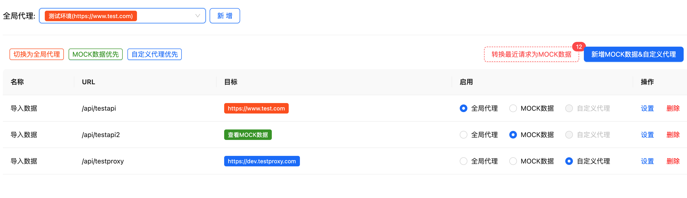

# mocxykit (旧名为 express-proxy-mock)


- [中文](./README.md)
- [English](./README_EN.md)

前端开发服务的中间件，主要用于代理请求和 MOCK 数据，可用于所有 webpack,vite和其它所有前端开发服务启动服务的开发项目,
此中间件应仅用于**开发**。

使用此中间件的一些好处包括：

- 代理请求和 MOCK数据
- 可视化的管理 MOCK 数据及代理功能
- 代理支持全局代理和某一个 URL 的自定义代理
- 可随时切换某一个URL进行代理转发或 MOCK 数据
- 可通过不同的入参，返回不同的MOCK 数据
- 可以快速把最近的请求返回的数据，存为 MOCK 数据

## 入门

首先，安装模块：

```console
npm install mocxykit --save-dev
```

### 示例

## 用法

### Webpack >= 5.0
修改 webpack.config.js
```js
module.exports = {
  //...
  devServer: {
    ...
  },
  plugins: [
      // 在 wepback 中会在插件里获取 devServer 并注入代理，devServer 不需要再配制
      new WebpackProxyMockPlugin({
        apiRule: '/api/*',
        lang: 'zh'
      })
  ]
};
```

### Webpack <= 4+

```js
// vue.config.js 或者其它 webpack config 文件 
const { proxyMockMiddleware } = require('mocxykit')

module.exports = {
  //...
   devServer: {
     before(app) {
      app.use(proxyMockMiddleware({
        apiRule: '/api/*',
        lang: 'en'
      }))
    }
   }
};
```

### vite
```js
// vite.config.js
import { defineConfig } from 'vite'
import { viteProxyMockPlugin } from 'mocxykit'

export default defineConfig({
  plugins: [
    viteProxyMockPlugin({
      apiRule: '/api/*',
      lang: 'zh',
      buttonPosition: 'bottom', // 可选：'top'(顶部)、'middle'(中间)、'bottom'(底部) 或坐标格式如 '100,100'
    })
  ]
})
```

### vue.config.js
```js
const proxyMockPlugin = new WebpackProxyMockPlugin({
        apiRule: '/api/*',
        lang: 'zh'
      })
module.exports = {
  //...
  devServer: {
    setupMiddlewares: (middlewares, devServer) => {
      // 在vue中，因 vue-cli在webpack 编译完成后,才注入 devServer,插件中获取不到 devServer配制，需要手动注入代理中间件
      proxyMockPlugin.setupDevServer(devServer.app);
      return middlewares;
    }
  },
  plugins: [
      proxyMockPlugin
  ]
};
```

### express
```js
const { proxyMockMiddleware } = require("mocxykit");
const express = require("express");
const app = express();

app.use(
  proxyMockMiddleware({
    // express-proxy-mock options
  }),
);

app.listen(3000, () => console.log("Example app listening on port 3000!"));
```
浏览器打开 http://localhost:3000/config 就可以看到代理与 MOCK 数据的配制界面
vite 项目会在页面右下角显示一个按钮，点击按钮即可打开配置页面

请参阅[下文](#其他服务器)以获取 vite, 与 webpack, 及 vueConfig 使用示例。

## 选项

|                      名称                       |               类型                |                    默认值                    | 描述                                                                                                          |
| :---------------------------------------------: | :-------------------------------: | :-------------------------------------------: | :------------------------------------------------------------------------------------------------------------------- |
|            **`apiRule`**            |              `string`              |              `/api/*`              | 全局代理的匹配规则,默认为所有 api 开头的请求                                          |
|            **`https`**            |     `boolean`     |                  `true`               | 是否代理 https 请求                                                                  |
|              **`configPath`**              |         `string`         |                 `/config`                  | 打开配制页面的地址，默认为http://localhost:3000/config                     |
|          **`cacheRequestHistoryMaxLen`**          |             `number`              |                  `30`                  |  缓存请求数据的最大条数                                                          |
|          **`lang`**          |             `string`              |                  `zh`                  |  语言                                                          |
|          **`buttonPosition`**          |             `'top' \| 'middle' \| 'bottom' \| string`              |                  `bottom`                  |  配置按钮位置（仅在Vite中生效）。可选值：'top'（顶部）、'middle'（中间）、'bottom'（底部）或坐标格式如'100,100'                                                          |


## 主要功能

### 代理请求和 MOCK 数据
- 支持配置多个代理服务器，可同时处理多个后端服务
- 支持 HTTP 和 HTTPS 协议的代理转发
- 提供简单的界面进行代理配置和管理

### 可视化管理界面
- 直观的 Web 界面，轻松管理所有代理和 MOCK 配置
- 实时预览和编辑 MOCK 数据
- 支持 JSON 格式的数据编辑和校验
- 提供请求历史记录查看功能

### 灵活的代理配置
- 支持全局代理：统一配置所有 API 请求的转发规则
- 支持单个 URL 的自定义代理：针对特定接口配置不同的代理规则
- 可以随时在全局代理和自定义代理间切换
- 支持正则表达式匹配 URL 路径

### 动态切换代理和 MOCK
- 每个 API 接口都可以独立控制使用代理或 MOCK 数据
- 实时切换无需重启服务
- 切换时自动保存当前配置

### MCP (Model Context Protocol)

### 功能介绍
MCP是一个基于SSE（Server-Sent Events）的实时数据通信协议实现，它提供了以下功能：
 
 在 cursor 等，支持 MCP 的 AI 编辑器，通过MCP协议，实现了在 AI 编程的时候，只要告诉 AI 对应的接口路径，AI就可以自动获取到对应的 MOCK 数据或浏览最近请求过的数据，无需人工干预。具体是MOCK 数据或浏览最近请求过的数据，根据你的数据目标设定，如果设定 mock 就会从MOCK 数据中获取，如果是代理就会比浏览器最近请求的数据中获取。如果是没有配制的URL，但符合全局代理也会从浏览器最近请求的数据中获取。

### 配制方法

在 cursor 的 MCP 设置中点击添加 Add MCP Server， type 选择 sse 然后配制http://127.0.0.1:xxxx/sse (这个是你项目的本地访问地址，但不能用localhost，必须用 IP,如果不能通过ip打开项目，可以试下把 host 设置为'0.0.0.0')，然后点击保存即可。

### 使用方法
在AI 编程中要让 AI 主动请求数据，需要写关键词 mcpData


1. 比如我想写一个 todoList： 

`在@todoList.tsx一个文件中实现一个 todoList 的功能，有展示列表及增加列表的功能，请求 mcpData api/todo-list获取列表数据结构，请求 mcpData api/todo-list/add 增加列表数据。 `

这样 AI 就会主动请求数据，然后根据数据结构生成代码。

2. 比如我在浏览上测试的时候，发现某一个接口的业务错务返加的数据没有覆盖到，我可以在 AI 编程中写：

`在 @todoList.tsx 文件中，请求 mcpData api/todo-list 获取数据，根据返回的错误数据，弹层显示错误信息。`

这样 AI 就会主动获取到错误数据，分析结构然后弹层显示错误信息。

### 主要特性

1. 智能数据源选择
- 从Mock数据中获取
- 支持从代理缓存获取历史数据，即浏览器近访问过的地址

2. 实时连接管理
- 自动维护SSE连接
- 支持多客户端同时连接
- 连接状态监控

### 智能 MOCK 数据
- 支持静态 MOCK 数据和动态 MOCK 数据
- 根据请求参数返回不同的 MOCK 数据
- 支持faker随机数据生成
  - 自动识别数据类型（如邮箱、手机号、URL等）并生成对应格式的随机数据
  - 支持中英文混合数据的智能生成
  - 通过特殊语法控制数组长度：`data.list<100>` 生成100条随机数据
  - 支持多字段随机化：`data.list,page.total`
  - 自动保持字符串格式：数字字符串保持位数，字母数字混合保持格式
- 配置方式：
  1. 在MOCK数据编辑页面勾选"返回随机数据"
  2. 在输入框中填写需要随机化的字段路径
  3. 支持的语法格式：
     - `data` - 随机化整个data对象
     - `data.list` - 只随机化list字段
     - `data.list<100>` - 生成100条随机数据
     - `data,page.total` - 多个字段随机化

### 快速数据采集
- 自动记录代理请求的响应数据
- 一键保存真实接口返回数据作为 MOCK 数据
- 支持编辑和修改已保存的 MOCK 数据
- 提供数据导入导出功能

## 环境变量

代理支持环境变量管理功能，您可以：
- 创建多个环境配置
- 将环境变量绑定到特定代理
- 快速切换不同环境
- 切换环境时自动清理浏览器缓存

### 开启环境变量功能

要启用环境变量功能，您需要：

1. 使用带有 DefinePlugin 的 webpack
2. 在 webpack 配置中添加 WebpackProxyMockPlugin
3. 或者用的是 vite 插件，直接在 vite.config.js 中添加 viteProxyMockPlugin


### 如何使用环境变量

1. 点击环境选择器旁边的"+"按钮创建新环境
2. 在环境配制中添加键值对
3. 可以在代理设置中将环境绑定到代理
4. 切换环境时，系统会提示是否清理浏览器缓存

### 功能特点

- **绑定功能**：代理可以绑定到特定环境
- **快速切换**：轻松切换不同环境
- **缓存管理**：切换环境时可选择清理浏览器缓存
- **可视化管理**：环境变量的可视化管理界面

## Ngrok 公网访问

本中间件支持使用 Ngrok 进行公网访问，让您的本地开发环境可以：

- 与外部用户共享本地开发环境
- 在不同设备上测试应用
- 向客户演示开发进度

### 设置外网访问

1. 打开配置页面 `http://localhost:3000/config`
2. 点击右上角的设置图标
3. 在 https://dashboard.ngrok.com/signup 注册免费的 Ngrok 账号
4. 从 Ngrok 控制台复制您的 authtoken
5. 将 authtoken 粘贴到设置弹窗中
6. 点击"开启外网访问"
 z
### 功能特点

- 自动创建隧道连接
- 安全的 HTTPS 端点
- 持久化存储 authtoken
- 便捷的 URL 复制功能
- 一键重置隧道连接

### 注意事项

- Ngrok 免费版有一些使用限制
- 每次创建新隧道时，公网 URL 会改变

## 联系我

QQ群：930832439

## License

[MIT](./LICENSE)