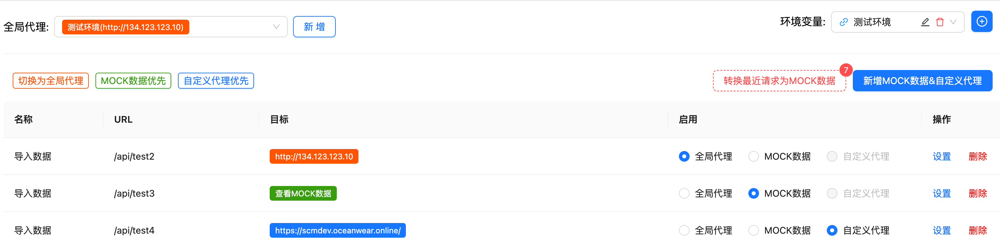

# mocxykit

- [中文](./README.md)
- [English](./README_EN.md)



Frontend development service middleware, mainly used for proxy requests and MOCK data. It can be used for all development projects that start services with webpack, vite, and other express-based servers. This middleware should only be used for **development**.

Some benefits of using this middleware include:

- Proxy requests and MOCK data
- Visual management of MOCK data and proxy functions
- Proxy support for global proxy and custom proxy for a specific URL
- Switch between proxy forwarding or MOCK data for a specific URL at any time
- Return different MOCK data based on different parameters
- Quickly save the data returned by the most recent request as MOCK data

## Getting Started

First, install the module:

```console
npm install mocxykit --save-dev
```

## Usage

### Webpack >= 5.0
Modify webpack.config.js
```js
module.exports = {
  //...
  devServer: {
    ...
  },
  plugins: [
     // In webpack, the plugin will get the devServer and inject the proxy, so no need to configure devServer separately
      new WebpackProxyMockPlugin({
        apiRule: '/api/*',
        lang: 'zh'
      })
  ]
};
```

### Webpack <= 4+

```js
// vue.config.js or other webpack config files 
const { proxyMockMiddleware } = require('mocxykit')

module.exports = {
  //...
   devServer: {
     before(app) {
      app.use(proxyMockMiddleware({
        apiRule: '/api/*',
        lang: 'en'
      }))
    }
   }
  };
```

### vite

```js
// vite.config.js
import { defineConfig } from 'vite'
import { viteProxyMockPlugin } from 'mocxykit'

export default defineConfig({
  plugins: [
    viteProxyMockPlugin({
      apiRule: '/api/*',
      lang: 'en',
      buttonPosition: 'bottom', // Optional: 'top', 'middle', 'bottom' or coordinate like '100,100'
    })
  ]
})
```


### vue.config.js
```js
const proxyMockPlugin = new WebpackProxyMockPlugin({
        apiRule: '/api/*',
        lang: 'zh'
      })
module.exports = {
  //...
  devServer: {
    setupMiddlewares: (middlewares, devServer) => {
      // In vue config, because vue-cli injects devServer after webpack compilation is complete, the plugin cannot get the devServer configuration, so you need to manually inject the proxy middleware
      proxyMockPlugin.setupDevServer(devServer.app);
      return middlewares;
    }
  },
  plugins: [
      proxyMockPlugin
  ]
};
```

### express
```js
const { proxyMockMiddleware } = require("mocxykit");
const express = require("express");
const app = express();

app.use(
  proxyMockMiddleware({
    // express-proxy-mock options
  }),
);

app.listen(3000, () => console.log("Example app listening on port 3000!"));
```
Open the browser at http://localhost:3000/config to see the configuration interface for proxy and MOCK data.
vite project will display a button in the bottom right corner of the page. Click the button to open the configuration page

Refer to [below](#other-servers) for usage examples with vite, webpack, and vueConfig.


## Options

|                      Name                       |               Type                |                    Default                    | Description                                                                                                          |
| :---------------------------------------------: | :-------------------------------: | :-------------------------------------------: | :------------------------------------------------------------------------------------------------------------------- |
|            **`apiRule`**            |              `string`              |              `/api/*`              | Global proxy matching rule, default is all requests starting with api                                          |
|            **`https`**            |     `boolean`     |                  `true`               | Whether to proxy https requests.                                                                  |
|              **`configPath`**              |         `string`         |                 `/config`                  | Address to open the configuration page, default is http://localhost:3000/config                     |
|          **`cacheRequestHistoryMaxLen`**          |             `number`              |                  `30`                  |  Maximum number of cached request data                                                          |
|          **`lang`**          |             `string`              |                  `zh`                  |  lang (en,zh)                                                          |
|          **`buttonPosition`**          |             `'top' \| 'middle' \| 'bottom' \| string`              |                  `bottom`                  |  Position of the configuration button (Only works in Vite). You can use 'top', 'middle', 'bottom' or coordinate string like '100,100'                                                          |


## Key Features

### Proxy Requests and MOCK Data
- Support configuring multiple proxy servers to handle multiple backend services
- Support both HTTP and HTTPS protocol forwarding
- Provide simple interface for proxy configuration and management

### Visual Management Interface
- Intuitive web interface for managing all proxy and MOCK configurations
- Real-time preview and edit MOCK data
- Support JSON format data editing and validation
- Provide request history viewing functionality

### Flexible Proxy Configuration
- Support global proxy: unified configuration for all API request forwarding rules
- Support custom proxy for individual URLs: configure different proxy rules for specific interfaces
- Switch between global and custom proxies at any time
- Support regular expression matching for URL paths

### Dynamic Proxy and MOCK Switching
- Each API interface can independently control the use of proxy or MOCK data
- Real-time switching without service restart
- Automatically save current configuration when switching

### Intelligent MOCK Data
- Support both static and dynamic MOCK data
- Return different MOCK data based on request parameters

### Quick Data Collection
- Automatically record proxy request response data
- One-click save real interface response as MOCK data
- Support editing and modifying saved MOCK data
- Provide data import and export functionality

## Environment Variables

The proxy supports environment variables management, which allows you to:
- Create multiple environment configurations
- Bind environment variables to specific proxies
- Quick switch between different environments
- Auto clear browser cache when switching environments

### Enabling Environment Variables

To enable the environment variables feature, you need to:

1. Use webpack with DefinePlugin
2. Add the WebpackProxyMockPlugin to your webpack configuration
3. Or use the vite plugin and add viteProxyMockPlugin directly to vite.config.js

### How to use environment variables

1. Click the "+" button next to the environment selector to create a new environment
2. Add key-value pairs in the environment configuration
3. You can bind an environment to a proxy in the proxy settings
4. When switching environments, the system will prompt whether to clear the browser cache

### Features

- **Binding**: A proxy can be bound to a specific environment
- **Quick Switch**: Easy switching between different environments
- **Cache Management**: Option to clear browser cache when switching environments
- **Visual Management**: Visual interface for managing environment variables

## Public Access with Ngrok

This middleware supports public access to your local development server using Ngrok. This feature allows you to:

- Share your local development environment with external users
- Test your application on different devices
- Demo your development work to clients

### Setting up Public Access

1. Open the configuration page at `http://localhost:3000/config`
2. Click the settings icon in the top right corner
3. Register for a free Ngrok account at https://dashboard.ngrok.com/signup
4. Copy your Ngrok authtoken from the dashboard
5. Paste the authtoken in the settings modal
6. Click "Enable Public Access"

### Features

- Automatic tunnel creation
- Secure HTTPS endpoints
- Persistent authtoken storage
- Easy URL sharing with copy functionality
- Quick tunnel recreation with reset button

### Notes

- The Ngrok free tier has some limitations
- Public URLs change each time you create a new tunnel
- For consistent URLs, consider upgrading to a paid Ngrok plan

## Contact Me

QQ Group: 930832439

## License

[MIT](./LICENSE)
