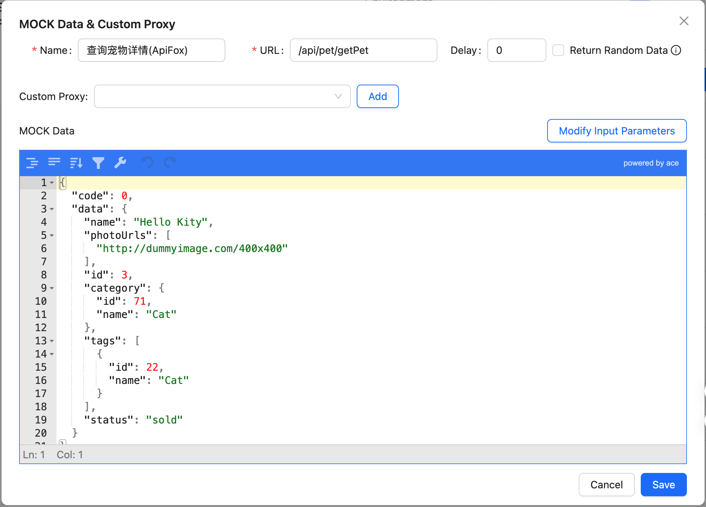
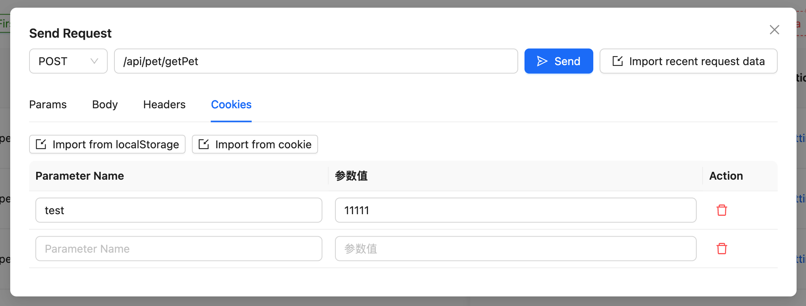
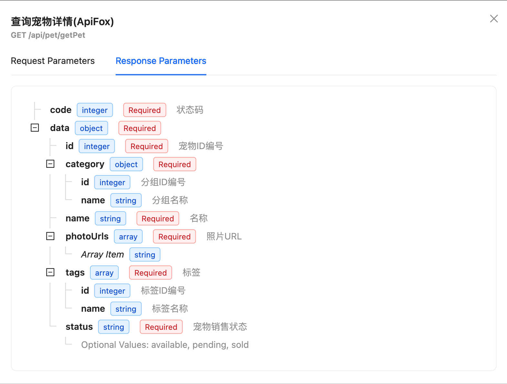
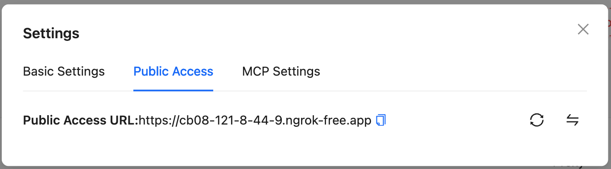

# mocxykit

- [中文](./README.md)
- [English](./README_EN.md)


Frontend development service middleware, mainly used for proxy requests and MOCK data. It can be used for all development projects that start services with webpack, vite, and other express-based servers. This middleware should only be used for **development**.

Some benefits of using this middleware include:

- Proxy requests and MOCK data
- Visual management of MOCK data and proxy functions
- Proxy support for global proxy and custom proxy for a specific URL
- Switch between proxy forwarding or MOCK data for a specific URL at any time
- Return different MOCK data based on different parameters
- Quickly save the data returned by the most recent request as MOCK data
- Support faker random data generation
- Support multi-environment variable management, switch environments at any time
- Support Ngrok public network access
- Support automatic synchronization of ApiFox documentation and generated mock data
- Support MCP protocol, allowing AI to automatically retrieve MOCK data or recent browser request data during AI programming
- Built-in API request tool for directly sending and testing API requests

## Getting Started

First, install the module:

```console
npm install mocxykit --save-dev
```

## Usage

### Webpack >= 5.0
Modify webpack.config.js
```js
module.exports = {
  //...
  devServer: {
    ...
  },
  plugins: [
     // In webpack, the plugin will get the devServer and inject the proxy, so no need to configure devServer separately
      new WebpackProxyMockPlugin({
        apiRule: '/api/*',
        lang: 'zh'
      })
  ]
};
```

### Webpack <= 4+

```js
// vue.config.js or other webpack config files 
const { proxyMockMiddleware } = require('mocxykit')

module.exports = {
  //...
   devServer: {
     before(app) {
      app.use(proxyMockMiddleware({
        apiRule: '/api/*',
        lang: 'en'
      }))
    }
   }
  };
```

### vite

```js
// vite.config.js
import { defineConfig } from 'vite'
import { viteProxyMockPlugin } from 'mocxykit'

export default defineConfig({
  plugins: [
    viteProxyMockPlugin({
      apiRule: '/api/*',
      lang: 'en',
      buttonPosition: 'bottom', // Optional: 'top', 'middle', 'bottom' or coordinate like '100,100'
    })
  ]
})
```

### vue.config.js
```js
const proxyMockPlugin = new WebpackProxyMockPlugin({
        apiRule: '/api/*',
        lang: 'zh'
      })
module.exports = {
  //...
  devServer: {
    setupMiddlewares: (middlewares, devServer) => {
      // In vue config, because vue-cli injects devServer after webpack compilation is complete, the plugin cannot get the devServer configuration, so you need to manually inject the proxy middleware
      proxyMockPlugin.setupDevServer(devServer.app);
      return middlewares;
    }
  },
  plugins: [
      proxyMockPlugin
  ]
};
```

### express
```js
const { proxyMockMiddleware } = require("mocxykit");
const express = require("express");
const app = express();

app.use(
  proxyMockMiddleware({
    // express-proxy-mock options
  }),
);

app.listen(3000, () => console.log("Example app listening on port 3000!"));
```
Open the browser at http://localhost:3000/config to see the configuration interface for proxy and MOCK data.
vite project will display a button in the bottom right corner of the page. Click the button to open the configuration page

Refer to [below](#other-servers) for usage examples with vite, webpack, and vueConfig.

## Options

|                      Name                       |               Type                |                    Default                    | Description                                                                                                          |
| :---------------------------------------------: | :-------------------------------: | :-------------------------------------------: | :------------------------------------------------------------------------------------------------------------------- |
|            **`apiRule`**            |              `string`              |              `/api/*`              | Global proxy matching rule, default is all requests starting with api. Multiple rules can be separated by commas, e.g. 'api/*,/test/*'                                          |
|            **`https`**            |     `boolean`     |                  `true`               | Whether to proxy https requests.                                                                  |
|              **`configPath`**              |         `string`         |                 `/config`                  | Address to open the configuration page, default is http://localhost:3000/config                     |
|          **`cacheRequestHistoryMaxLen`**          |             `number`              |                  `30`                  |  Maximum number of cached request data                                                          |
|          **`lang`**          |             `string`              |                  `zh`                  |  lang (en,zh)                                                          |
|          **`buttonPosition`**          |             `'top' \| 'middle' \| 'bottom' \| string`              |                  `bottom`                  |  Position of the configuration button (Only works in Vite). You can use 'top', 'middle', 'bottom' or coordinate string like '100,100'                                                          |

## Key Features

### Proxy Requests and MOCK Data
- Support configuring multiple proxy servers to handle multiple backend services
- Support both HTTP and HTTPS protocol forwarding
- Provide simple interface for proxy configuration and management

### Visual Management Interface
- Intuitive web interface for managing all proxy and MOCK configurations
- Real-time preview and edit MOCK data
- Support JSON format data editing and validation
- Provide request history viewing functionality

### Flexible Proxy Configuration
- Support global proxy: unified configuration for all API request forwarding rules
- Support custom proxy for individual URLs: configure different proxy rules for specific interfaces
- Switch between global and custom proxies at any time
- Support regular expression matching for URL paths

### Dynamic Proxy and MOCK Switching
- Each API interface can independently control the use of proxy or MOCK data
- Real-time switching without service restart
- Automatically save current configuration when switching



## API Request Tool

mocxykit includes a powerful API request tool that allows you to test and debug API interfaces directly in the configuration interface, without switching to other tools.

### Features

- **Multiple Request Methods**: Support for common HTTP methods including GET, POST, PUT, DELETE, PATCH, etc.
- **Parameter Configuration**: Configure query parameters, headers, cookies, and request body
- **Auto-fill Configuration**: Headers and cookies are automatically imported from the most recent request by default
- **Parameter Type Settings**: Support for string, number, and boolean parameter types
- **JSON Editor**: Built-in JSON editor for easy editing of request body and viewing response data
- **Request History**: View and resend requests from recent history
- **Import Functionality**: Support importing data from localStorage and cookies
- **Response Viewing**: Clear display of response status, headers, and data
- **One-click Mock Import**: Import response data as Mock data with one click

### How to Use

1. Click the "Send Request" button in the API list or recent requests
2. Configure the request method and URL
3. Set parameters, request body, headers, and cookies in different tabs
4. Click the "Send" button to send the request
5. View the response data
6. Optionally import the response data as Mock data

### Data Import Features

- **Import from localStorage**: Import data from localStorage as request headers or cookies
- **Import from cookies**: Import browser cookies as request cookies
- **Import from history**: Import configurations from previously sent requests

### Response Data Handling

- Automatic recognition and formatting of JSON responses
- Display of response status code and status text
- Complete response header information
- Support for one-click import of response data as Mock data



## Synchronize ApiFox Data

mocxykit supports integration with the ApiFox platform, allowing you to easily synchronize API data from ApiFox to your local development environment, including MOCK data and documentation.

### Features

- **One-click Synchronization**: Synchronize API data from ApiFox to your local development environment with one click
- **Selective Synchronization**: Choose specific API groups for synchronization
- **Automatic URL Completion**: Automatically add prefixes to API paths
- **Automatic Synchronization**: Support automatic synchronization of ApiFox data each time the page is opened

### How to Use

1. Click the "Synchronize ApiFox Data" button in the configuration interface
2. Enter your ApiFox Access Token
   - Log in to the ApiFox website (https://app.apifox.com/user/login)
   - After logging in, copy the value of the common.accessToken field from your browser's localStorage
3. Select the project you want to synchronize
4. Select the API groups you want to synchronize
5. Configure synchronization options:
   - Automatic URL Completion: When enabled, prefixes will be automatically added to API paths during synchronization
   - Automatic Synchronization: When enabled, ApiFox data will be automatically synchronized each time the page is opened
   - API Rule: Select the applicable API rule (if multiple rules are configured)

### Automatic Synchronization Feature

When the automatic synchronization feature is enabled, mocxykit will automatically retrieve the latest API data from ApiFox each time the page loads, ensuring that your local development environment always uses the most up-to-date API definitions.

### API Documentation Viewing

After synchronizing ApiFox data, you can view detailed API documentation in the mocxykit interface, including:

- Request parameter documentation
- Response parameter documentation
- Parameter types and descriptions
- Required field indicators
- Array and object structure display



## MCP (Model Context Protocol)

### Introduction
MCP is a real-time data communication protocol implementation based on SSE (Server-Sent Events), which provides the following features:

In AI editors that support MCP (such as Cursor), through the MCP protocol, when doing AI programming, you only need to tell the AI the corresponding API path, and the AI can automatically retrieve the corresponding MOCK data or recently requested data without manual intervention. Whether it's MOCK data or recently requested data depends on your data target settings. If set to mock, it will retrieve from MOCK data; if set to proxy, it will retrieve from the browser's recent request data. If it's an unconfigured URL but matches the global proxy, it will also retrieve from the browser's recent request data.

### Configuration Method

Click the settings icon in the top right corner of the mocxykit configuration interface, switch to MCP settings, and simply check the corresponding editor to enable the MCP service. Finally, you need to check the MCP settings in Cursor's settings to see if it shows "disabled" (disabled by default). If so, click to enable this service.

### Usage
To make AI actively request data in AI programming, you need to write the keyword mcpData.

1. For example, if I want to write a todoList:
`In @todoList.tsx file, implement a todoList function with list display and list addition features, request mcpData api/todo-list to get the list data structure, request mcpData api/todo-list/add to add list data.`
This way, AI will actively request data and generate code based on the data structure.

2. For example, when testing in the browser, if I find that an interface's business logic returns data that isn't covered, I can write in AI programming:
`In @todoList.tsx file, request mcpData api/todo-list to get data, display error message in a popup based on the returned error data.`
This way, AI will actively retrieve the error data, analyze the structure, and display the error message in a popup.


### Key Features

1. Smart Data Source Selection
- Retrieve from Mock data
- Support retrieving from proxy cache history data (recently accessed addresses in browser)

2. Real-time Connection Management
- Automatic SSE connection maintenance
- Support multiple client connections simultaneously
- Connection status monitoring

## faker MOCK Data
- Support both static and dynamic MOCK data
- Return different MOCK data based on request parameters
- Support faker random data generation
  - Auto-detect data types (email, phone, URL, etc.) and generate corresponding random data
  - Smart generation of mixed Chinese and English content
  - Control array length with special syntax: `data.list<100>` generates 100 random items
  - Support multiple field randomization: `data.list,page.total`
  - Auto maintain string formats: preserve digits for number strings, maintain format for alphanumeric strings
- Configuration:
  1. Check "Return Random Data" in MOCK data edit page
  2. Enter the field path to be randomized in the input box
  3. Supported syntax:
     - `data` - Randomize entire data object
     - `data.list` - Only randomize list field
     - `data.list<100>` - Generate 100 random items
     - `data,page.total` - Randomize multiple fields

## Environment Variables

The proxy supports environment variables management, which allows you to:
- Create multiple environment configurations
- Bind environment variables to specific proxies
- Quick switch between different environments
- Auto clear browser cache when switching environments

### Enabling Environment Variables

To enable the environment variables feature, you need to:

1. Use webpack with DefinePlugin
2. Add the WebpackProxyMockPlugin to your webpack configuration
3. Or use the vite plugin and add viteProxyMockPlugin directly to vite.config.js

### How to use environment variables

1. Click the "+" button next to the environment selector to create a new environment
2. Add key-value pairs in the environment configuration
3. You can bind an environment to a proxy in the proxy settings
4. When switching environments, the system will prompt whether to clear the browser cache

### Features

- **Binding**: A proxy can be bound to a specific environment
- **Quick Switch**: Easy switching between different environments
- **Cache Management**: Option to clear browser cache when switching environments
- **Visual Management**: Visual interface for managing environment variables

## Public Access with Ngrok

This middleware supports public access to your local development server using Ngrok. This feature allows you to:

- Share your local development environment with external users
- Test your application on different devices
- Demo your development work to clients



### Setting up Public Access

1. Open the configuration page at `http://localhost:3000/config`
2. Click the settings icon in the top right corner
3. Register for a free Ngrok account at https://dashboard.ngrok.com/signup
4. Copy your Ngrok authtoken from the dashboard
5. Paste the authtoken in the settings modal
6. Click "Enable Public Access"

### Features

- Automatic tunnel creation
- Secure HTTPS endpoints
- Persistent authtoken storage
- Easy URL sharing with copy functionality
- Quick tunnel recreation with reset button

### Notes

- The Ngrok free tier has some limitations
- Public URLs change each time you create a new tunnel
- For consistent URLs, consider upgrading to a paid Ngrok plan


## Contact Me

QQ Group: 930832439

## License

[MIT](./LICENSE)
